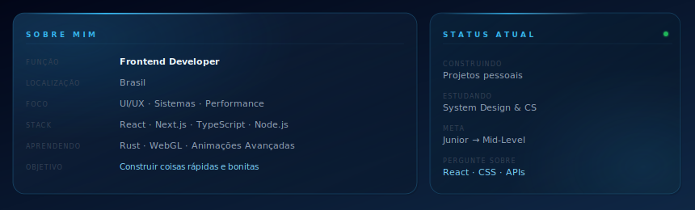

 

  
  &nbsp;
  
  &nbsp;
  

 

---

 

 

---

 

### Stack de Tecnologias

 

**— Linguagens —**

  

**— Frontend —**

  

**— Backend e Banco de Dados —**

  

**— Ferramentas e Infraestrutura —**

 

---

 

### Foco Atual

 

<table width="92%">
  <tr>
    <td align="center" width="25%">
        
      <b>Frontend</b> 
      React · Next.js · TypeScript
    </td>
    <td align="center" width="25%">
        
      <b>Backend</b> 
      Node.js · Python · REST APIs
    </td>
    <td align="center" width="25%">
        
      <b>Banco de Dados</b> 
      SQLite · MySQL · MongoDB
    </td>
    <td align="center" width="25%">
        
      <b>UI Criativa</b> 
      Motion · Design · UX
    </td>
  </tr>
</table>

 

---

 

### GitHub

 

  

  

  

 

---

 

### Fluxo de Contribuições

 

<picture>
  <source media="(prefers-color-scheme: dark)" srcset="https://raw.githubusercontent.com/lukaszwx/lukaszwx/output/pacman-contribution-graph-dark.svg">
  <source media="(prefers-color-scheme: light)" srcset="https://raw.githubusercontent.com/lukaszwx/lukaszwx/output/pacman-contribution-graph.svg">
  
</picture>

 

---

 

### Contato

 

&nbsp;

&nbsp;

  

> *"Primeiro resolva o problema. Depois escreva o código."* — John Johnson

 

